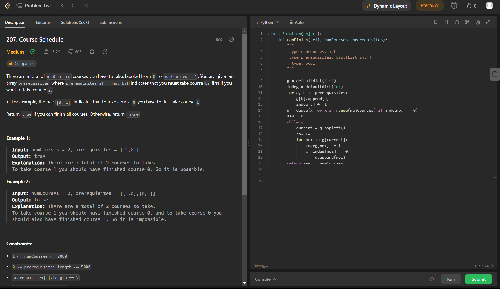
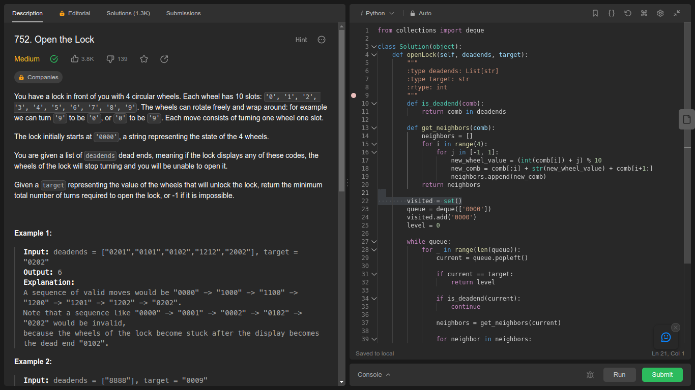
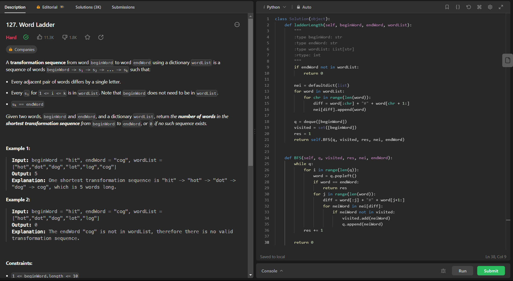

# LeetCodeExercicios

**Número da Lista**: 1 
**Conteúdo da Disciplina**: Grafos1 

## Alunos
|Matrícula | Aluno |
| -- | -- |
| 20/0049020  |  Gabriel Barbosa Alencar |
| 21/1031708  |  Geovane Freitas |

## Sobre 
Este repositório contém a resolução de alguns exercícios do [LeetCode](https://leetcode.com/) relacionados a Grafos, contemplando os algoritmos de BFS, DFS e outros.

## [Link da Apresentação]()

## Screenshots

## Exercicio 1 - Shortest Bridge

Dificuldade: Médio  
Link: [Shortest Bridge](https://leetcode.com/problems/shortest-bridge/)

## Exercicio 2 - Course Schedule
Dificuldade: Médio  
Link: [Course Schedule](https://leetcode.com/problems/course-schedule/)

## Exercicio 3 - 
Dificuldade: Médio  
Link: [Open the Lock](https://leetcode.com/problems/open-the-lock/)

## Exercicio 4 - Word Ladder
Dificuldade: Difícil  
Link: [Word Ladder](https://leetcode.com/problems/word-ladder/)

## Instalação 
**Linguagem**: Python 

Caso queira testar localmente é necessário ter o python instalado
## Uso 
Para verificar o funcionamento basta abrir o link do exercicio e copiar o código referente a questão, e logo após realizar o envio. Caso queira verificar localmente, é necessário adicionar a chamada da função principal com seus devidos paramêtros. para rodar basta utilizar o comando:

`python3 NomeDoArquivo.py`
